# camel-amq-poc

## Installation on OpenShift

_This assumes that the **Red Hat Streams for Apache Kafka** operator is already installed_

Go to the Administrator perspective

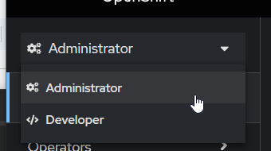

Select the Operators

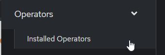

Click Kafka
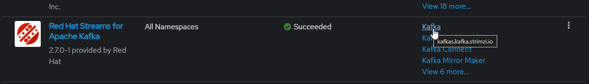

Deploy a Kafka cluster

Select _Current namespaces only_
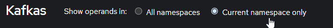

Then "Create Kafka"
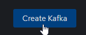

Keep all the settings as default and click "Create" on the bottom

This will take a couple minutes to properly initialize

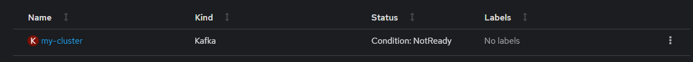

Scroll to the right and click _Kafka Topic_ 

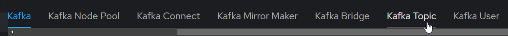

Click the _Create KafkaTopic_ button

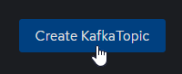

Keep all settings as default and click _Create_ at bottom

Return to the _Developer_ perspective

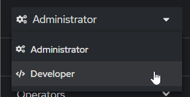

Click _+Add_ button

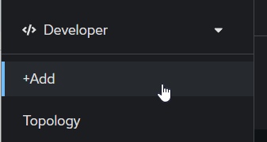

Select _Import from Git_

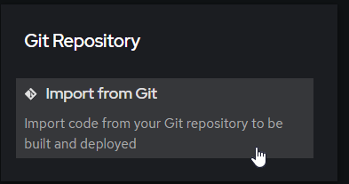

Enter the URL: https://github.com/mike4263/camel-amq-poc.git
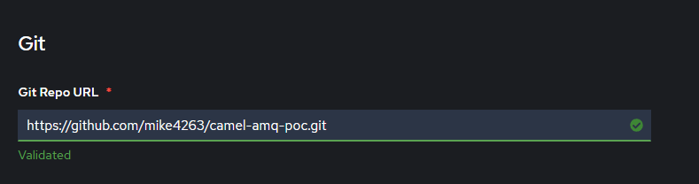

It should auto detect the Builder Image

_NOTE: OpenShift 4.13 and older may specify a builder image that does not work properly with quarkus. ([bug](https://github.com/jboss-container-images/openjdk/pull/358))_
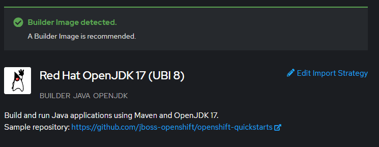

Create a new _VistA_ application group

Enter Vista as the of the application group and _vista-app_ as the name of the resources:

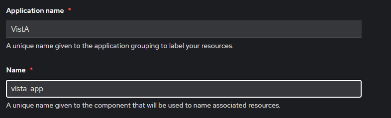

Select "Deployment" as the Resource Type
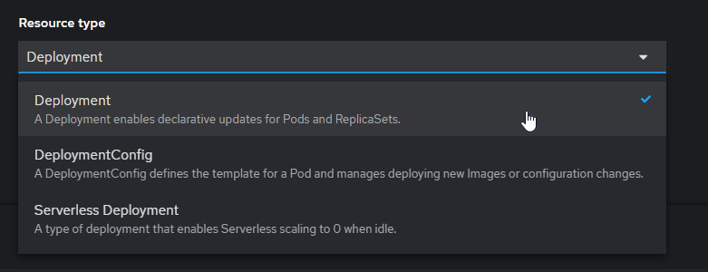

Scroll down to the bottom.  Click _Deployment_ and enter the environment variables:

| Env Variable | Name |
|--------------|------|
| BOOTSTRAP_URL             | my-cluster-kafka-bootstrap:9092     |
| QUARKUS_PROFILE             | prod     |

Click _Create_

Click on the lower left circle to watch the build process
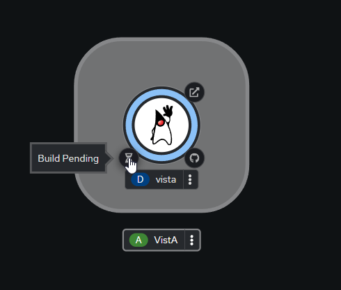

The build will take a couple minutes.  After the build is complete, click _Topology_ on the left to return to the topology overview.

Click the blue ring to pull up the side pane.

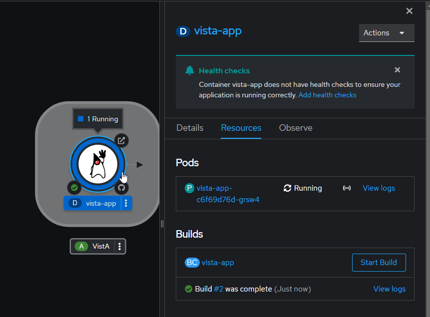

Click _View logs_

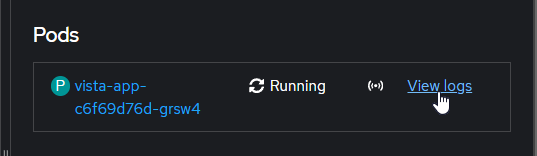

If everything worked properly, you should see the following in the logs

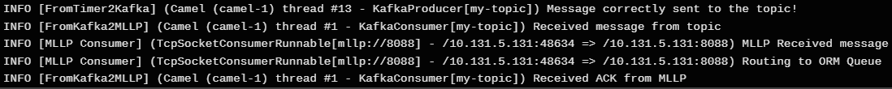

